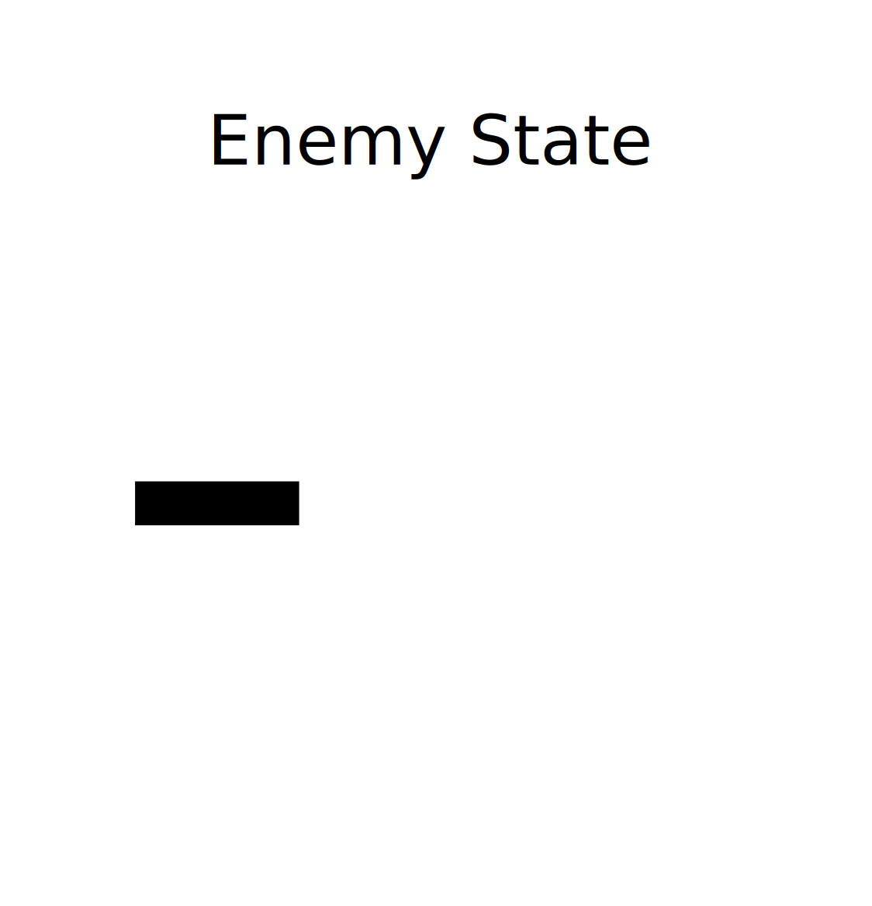

# Godot FSM Example

A simple demonstration of a finite state machine (FSM) implemented in Godot (GDScript) featuring a player and an enemy NPC. The enemy responds to the player's proximity by switching between three behaviors: **Idle (wandering)**, **Follow**, and **Attack**.

---

**Demo Live**: [Try it](https://ucfx.github.io/godot-fsm-example/)

---

## Table of Contents

- [Overview](#overview)  
- [What is a Finite State Machine (FSM)?](#what-is-a-finite-state-machine-fsm)  
- [Example Description](#example-description)  
  - [States](#states)  
  - [Transitions](#transitions)  
- [How to Run](#how-to-run)  
- [Extending the Example](#extending-the-example)  
- [License](#license)

---

## Overview

This project illustrates how to apply an FSM design pattern in Godot. It uses a player and enemy, where the enemy changes behavior based on the player's distance. The FSM approach keeps logic clean and modular—ideal for game AI and behavior control.

## What is a Finite State Machine (FSM)?

A **Finite State Machine (FSM)** is a computational model used to design systems with a limited number of specific states. Each state represents a distinct behavior, and the system transitions between states based on conditions or events. FSMs are powerful tools for managing AI logic, UI flows, animations, and more due to their clarity and predictability.

## Example Description

This example uses an FSM to manage enemy behavior relative to the player.

### States

- **Idle (Wandering)**:  
  The enemy moves randomly within its area, simulating a patrol/wandering behavior when the player is not nearby.

- **Follow**:  
  Triggered when the player comes within a detection radius. The enemy starts moving directly toward the player.

- **Attack**:  
  Triggered when the player is very close. The enemy begins an attack sequence.

### Transitions

1. **Idle → Follow**  
   - Condition: Player enters detection range (e.g. `player_distance < detect_radius`).

2. **Follow → Attack**  
   - Condition: Player is within attack range (e.g. `player_distance < attack_radius`).

3. **Attack → Follow**  
   - Condition: Player moves out of attack range but is still within detection range.  
   - The enemy stops attacking and resumes following.

4. **Follow → Idle**  
   - Condition: Player moves out of detection range entirely.  
   - The enemy goes back to random wandering.

Visual diagram:



---

## How to Run

1. Clone the repository:
   ```bash
   git clone https://github.com/ucfx/godot-fsm-example.git
   ```
2. Open the project in Godot (3.x or 4.x, depending on your setup).
3. Load the `Level.tscn` scene.
4. Run the scene and observe:
   - The enemy wanders randomly when idle.
   - Approaching the enemy causes it to follow.
   - Getting very close switches it to attack.
   - Backing away makes the enemy return to wandering.

## Extending the Example

- **Add more states**: e.g. `Patrol`, `Flee`, `Search`.  
- **Animations per state**: Idle walk cycle, attack animation, etc.  
- **Randomized wandering behavior**: Change speed, pause, or random directions.  
- **Multiple enemies**: Scale the same FSM logic across many NPCs.  
